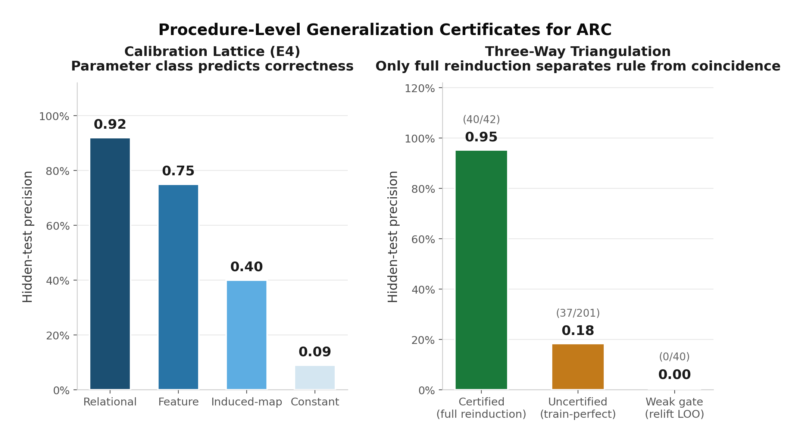
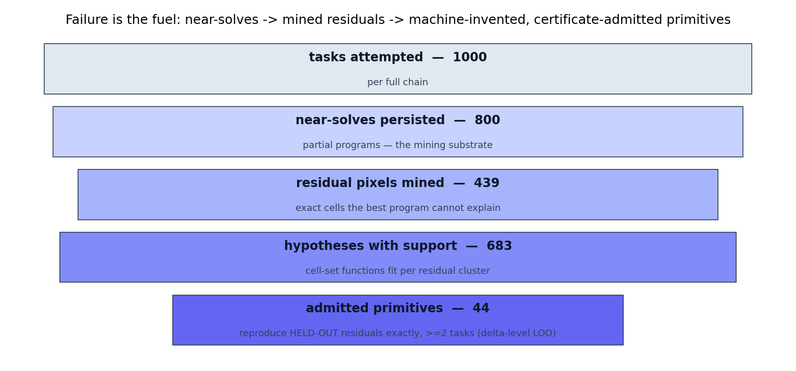
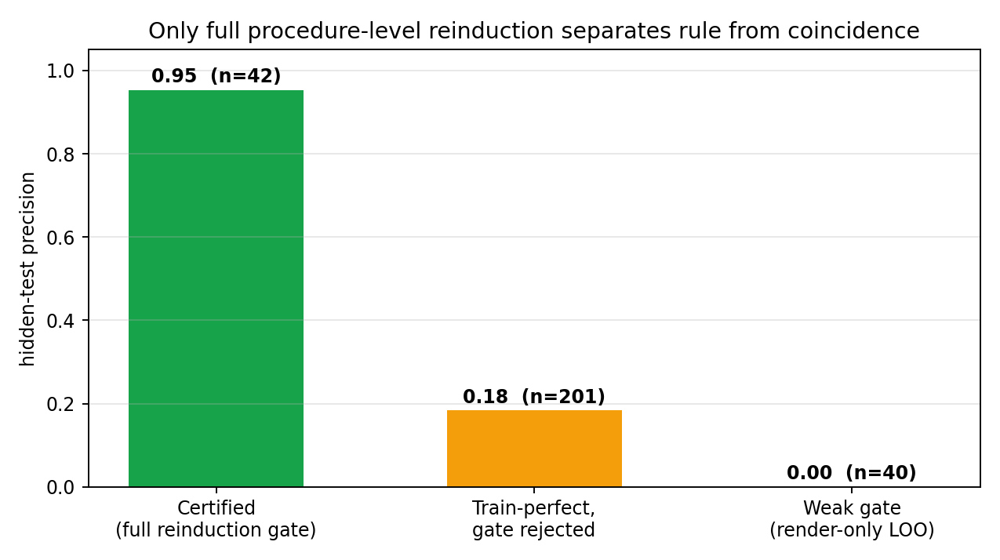
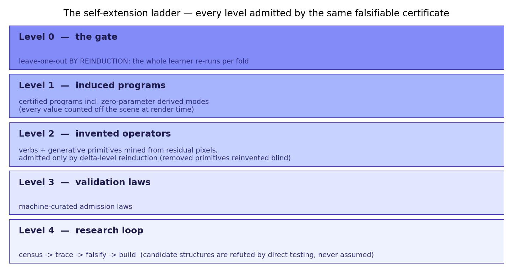

# The Learner Must Re-Derive
### Procedure-Level Generalization Certificates for Abstract Reasoning (ARC-AGI)

A program-induction system for ARC in which **a task only counts as solved
if the entire learning procedure, re-run from N−1 of its training examples,
independently re-derives a program that solves the held-out example — for
every fold.** The certificate validates the *learner*, not the artifact:
a lucky program cannot pass it, because luck does not re-run.





## Why certificates matter
The same search, freed from the generalization requirement, *quintuples*
its claimed solves while hidden-test precision collapses. Three independent
measurements triangulate the point — remove the gate, precision falls to
0.18; weaken it to render-only verification, precision falls to **zero**.



## The system invents its own primitives
A mining loop harvests the exact pixels its best programs cannot explain,
clusters them by geometric relation to scene objects, and admits new
generative primitives **only if they reproduce held-out residuals exactly,
on every fold, across multiple tasks** — the same certificate, one level
down. In the flagship experiment, hand-added primitives were deleted and
the miner **reinvented them blind from residual data, re-certifying the
same task** with no human having named either primitive.



## Certified progress, round by round
Every gain is a *certified* solve; every round that yielded zero is
recorded with its diagnosis. The falsification discipline runs both ways:
one candidate structure (inter-object connectors) was **refuted by direct
trace testing and never built**, while its exemplars were reclassified
into families that do reproduce the evidence.

Recent rounds:
- **Derived-pattern modes** — programs that *derive* their pattern from the
  scene at render time (`periodic_self`: the object's own internal period;
  `frame_minority`: ring thickness = the **count** of the object's
  minority-colour cells — a zero-parameter program). One certified gain
  landed *outside* the diagnosed exemplar set: the modes generalize past
  the traces that motivated them.
- **Obstacle-conditional rays** — the input scene threaded into the growth
  path, enabling stops, deflections and cavity leaks that are undefinable
  as pure functions of an object's own cells.
- **Graduated certificates** — a syntactic preference lattice over
  parameter expressions predicts hidden-test correctness monotonically
  (relational 0.92 → constant 0.09) with zero test access.
- **The gate generalizes across learner classes** — applied in strong form
  to a per-task neural learner (retrain per fold from scratch): 100%
  gated precision, zero false positives, n=37.

## Repository map
| Path | Contents |
|---|---|
| `geocat_arc/object_reasoning/` | the certified induction engine (segmentation, correspondence, delta vocabulary, generative programs, derived-pattern + ray modes, generator mining) |
| `paper/` | full paper (`DRAFT.md`) + LaTeX build (`latex/main.pdf`, 10 pp) |
| `kaggle/` | competition package: writeup, cover image, dataset build, submission checklist |
| `scripts/` | harness runners, diagnosis + trace tooling, paper table generation |
| `tests/` | per-round regression + certification tests (engine suite 440+) |
| `RUN_HISTORY.md` | the complete experimental chronology, including every negative result |

## Reproducing the numbers
All headline figures regenerate from disk artifacts:
```bash
python3 scripts/paper_tables.py     # -> outputs/paper_tables.json
```
Full 1000-task chain (offline, CPU):
```bash
export ARC_DIHEDRAL_FRAMES=45 ARC_GENERATIVE=1 ARC_PATTERN_DERIVE=1
python3 scripts/run_unified_harness.py --workers 16 --out-dir outputs/run --run-id repro
```
