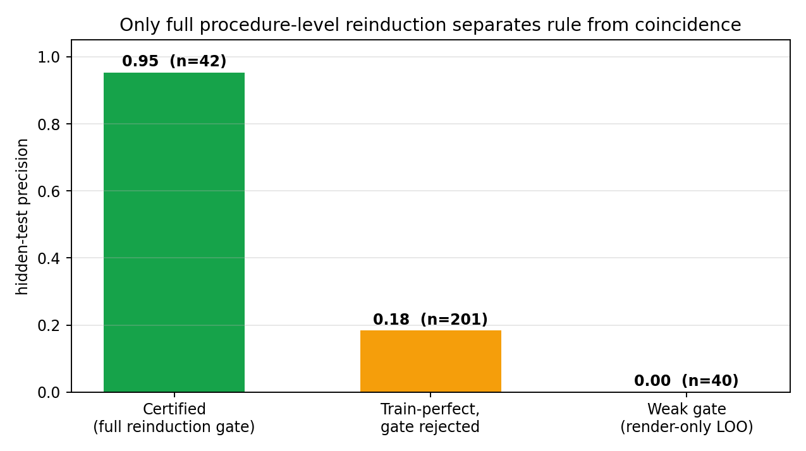
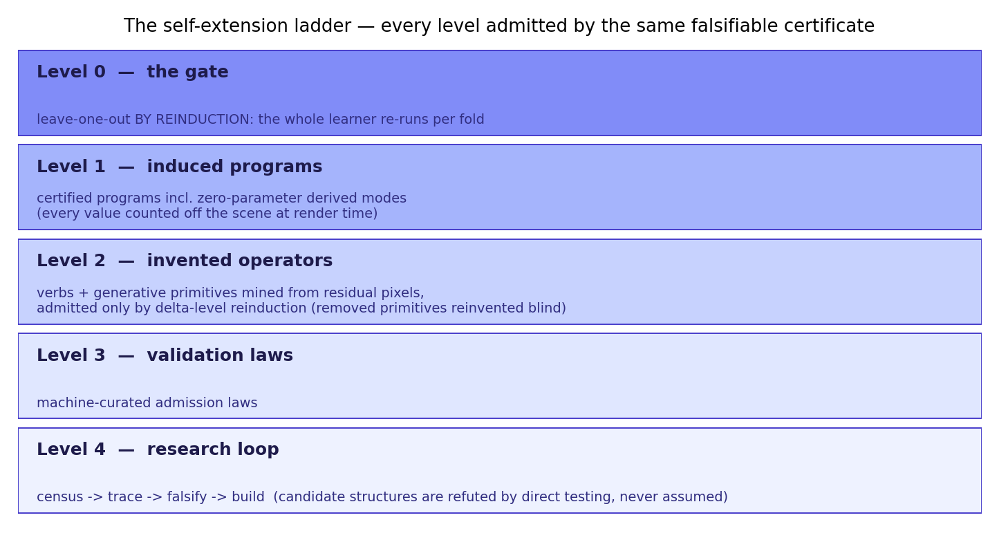

# The Learner Must Re-Derive
### Certified program induction and failure-driven language extension for ARC-AGI-2 (CORA)

**Status, 7 October 2026.** The base reasoner solves **185 of the 1,000
ARC-AGI-2 training tasks** with procedure-level certificates (v23, sealed
19 August 2026) and **0 of the 120 public evaluation tasks**. Since then the
work has asked whether the reasoner can extend its own language when it
fails: build a new executable rule from its failure, verify it, use it, and
discard it after the task. The latest result, on synthetic tasks, is a
complete closed loop inside the same reasoner on **27 of 30 new tasks**
after one generic engine repair (12 of 30 before). **No real ARC task has
yet been solved by a constructed rule**; a pilot on real training tasks is
being designed and has not run.

| | result | when | evidence |
|---|---|---|---|
| base reasoner, 1,000 training tasks | 185 certified (18.5%; 19.9% with two attempts) | sealed 2026-08-19 | `paper/`, `RUN_HISTORY.md` |
| base reasoner, public evaluation | 0 of 120 locally; Kaggle public score 0.0 at the first submission (12 July) | Jul-Aug 2026 | `RUN_HISTORY.md` |
| closed loop on synthetic tasks (v1.9) | 27 of 30 complete witnesses against 12; 237 of 239 certified outputs correct | 2026-10-07 | [result record][v19] |
| real ARC causal pilot | training split verified by checksum; design in progress; not run | 2026-10-07 | [data audit][pilot] |
| new 1,000-task training run | not started; blocked until the pilot produces a real witness | | [project map][map] |
| Step B, durable semantic invention | running since 2026-08-25; no verdict | | `level4_stepB/` |

## The question

Ordinary learning adjusts weights; ordinary search looks for a program
inside a fixed language. CORA tests a third move:

    reason -> fail -> observe the failure -> construct a new rule e
      -> verify it -> install it for this task (K -> K + {e}) -> reason again

A rescue counts only as a complete **B/P/U/L/T/A witness**, all six at once:

- **B**: the baseline reasoner fails the task;
- **P**: a new rule is produced and selected;
- **U**: the winning program uses it;
- **L**: leave-one-out passes, with the proposal rebuilt in every fold;
- **T**: the held-out test answer is exact;
- **A**: without the rule the gain disappears, even with three times the
  search budget.

A better score, a faster search or the reconstruction of a known operator is
not enough.

## Latest findings: the delivery sprint (23 September to 7 October 2026)

Every step was preregistered and hashed before its data existed, each freeze
got one adversarial review, and errata were recorded before any outcome. The
code, protocols and records are on the [`arc2026-sprint`][sprint] branch.

| step | question | answer | key numbers |
|---|---|---|---|
| failure-frontier audit | does the real engine record its own failures? | no, then repaired | no usable evidence on 12 of 12 tasks; after two repairs, 8 of 12 (the preregistered threshold) |
| v1.2 corpus | can a failure-to-rule training set be built? | yes | 215 episodes, 11 of 11 gates |
| scorer fit and diagnosis | does failure evidence help choose the rule? | no | beats shuffled evidence, not the demonstrations; the corpus could not answer |
| v1.3 contrastive corpus | can the failure summary separate two close targets? | no | 0.470 against an exact null of 0.429 |
| v1.4 localization | with identical inputs, where does target information live? | yes, but weaker than the demonstrations | 0.565 against 0.5; demonstrations alone 0.664 |
| v1.5 selection | does failure evidence add to the demonstrations? | no | 0.585 against 0.591, 288 groups |
| v1.6 bounded repair | does a candidate's **effect** on the failed reasoner add to them? | yes (hybrid) | 0.641 against 0.580 on 136 ambiguous groups, p 3.8e-5 |
| v1.7 compiler | can a selected rule become a production of the same engine? | yes | 6 of 6 accepted, used, exact; 3x-budget baseline 0 of 6 |
| v1.8 no-oracle proposer | can the rule come from the engine's own failure? | specific, not end to end | beats transplanted and blind failure evidence 13 to 0 and 7 to 0; complete witnesses 11 of 30 (15 required) |
| v1.9 engine stability | why did the engine reject produced rules on six-pair folds? | one cause, repaired | all 145 development rejections traced to two native heuristics re-applied inside its own leave-one-out; prospectively, witnesses 27 of 30 against 12 |

What we take from it:

1. **Failure is useful as an intervention target, not as a description.**
   Passive summaries of the failure never beat the demonstrations (v1.2 to
   v1.5). Measuring what each candidate rule does to the failed reasoner did
   (v1.6).
2. **The bottleneck moved from the proposer to the reasoner's own
   acceptance.** The proposer chose correctly from the failure (v1.8); the
   engine then rejected its choice for a mechanical reason that one generic,
   prospectively tested repair removed (v1.9).
3. **The engine does not tell right rules from wrong ones.** The repaired
   engine accepted every wrong installed rule it was given (5 of 5 with seven
   demonstrations, 28 of 28 with four). On real tasks correctness has to come
   from selection, held-out checks and abstention, so the real pilot is built
   around abstaining when the evidence is thin.

**Not shown:** any real ARC task solved by a constructed rule; any training
score above 185; any evaluation success; semantic invention or
self-improvement. Every sprint result is synthetic, and v1.9 is limited to
rules whose table keys are witnessed at least twice, which the synthetic
corpus guarantees by construction.

## The foundation: procedure-level certificates (v23 engine)

A task counts as solved only if the **entire learning procedure, re-run from
N-1 of its training examples, independently re-derives a program that solves
the held-out example, on every fold.** The certificate validates the learner,
not the artifact: a lucky program cannot pass, because luck does not re-run.

- **Certificates separate rule from coincidence.** On training tasks,
  certified programs were right on the hidden test 40 times in 42; programs
  that fit every example but failed leave-one-out were right 37 times in 201.
  Remove the gate and precision falls to 0.18; weaken it to render-only
  verification and it falls to zero. Off-distribution the calibration is
  poor (0 of 11 on an evaluation development split), and most evaluation
  tasks need rules the engine's language cannot express.
- **Graduated certificates.** A syntactic lattice over parameter expressions
  (relational > feature > induced map > constant) predicts hidden-test
  correctness monotonically (0.92 to 0.09) with no test access.
- **The system invents its own primitives.** Residual pixels its best
  programs cannot explain are mined, clustered and fit by candidate cell-set
  functions, admitted only if they reproduce held-out residuals exactly. With
  the hand-added primitives deleted, the miner **reinvented them blind and
  re-certified the same task** (experiment E10).
- **Zero-parameter derived programs** count every value off the scene at
  render time; one certified a task outside the exemplars that motivated it.
- **The gate crosses learner classes.** Applied to a per-task neural learner
  retrained per fold, it separated right from wrong answers perfectly
  (n = 37).





## Branches

| branch | contents |
|---|---|
| `main` | the v23 certified engine (`geocat_arc/`), the engine paper (`paper/`), the Kaggle package, the frozen Step-B substrate, and the full chronology `RUN_HISTORY.md` |
| [`cora-tti-dev`][tti] | the CORA-TTI program (31 August to 15 September): runtime emulator, typed failure graph, test-time invention attempts, transfer and abstraction studies, and the frozen Capability-Growth Gate protocol for Step B. Commit `e5ef8b5` is the snapshot under which its v2 census was reconstructed. |
| [`arc2026-sprint`][sprint] | the ARC Prize 2026 delivery workspace (23 September onward): the v1.2 to v1.9 experiment chain with every protocol, result, review and erratum, the authoritative manuscript `docs/PAPER_SKELETON.md`, the Kaggle writeup, the real ARC pilot design, and the [project map][map]. Its code imports `cora_tti` and `cora_parent` from `cora-tti-dev` at `98d71a7`. |

## Timeline

| when | what | key number |
|---|---|---|
| Dec 2025 | first prototype: program language, language-model hints, learned ranking | prototype only |
| Apr 2026 | restart as a research program on synthetic worlds | falsification nearly eliminated false rules |
| May-Jun 2026 | real ARC, solver portfolio, module audit, object engine started | 67 of 1,000; 0 false positives in 480 audit runs |
| Jul 2026 | sealed runs with certificates; first Kaggle submission | 151 to 173 of 1,000; Kaggle 0.0 |
| Aug 2026 | generated rules, primitives reinvented from residuals, v23 sealed | **185 of 1,000** |
| Aug 2026 | CORA adopted; Step B frozen and launched | no verdict yet |
| Sep 2026 | test-time invention attempts, transfer and abstraction studies | DEV-60 0.0; 0 of 1,500 targets admitted; no reach gain |
| Sep-Oct 2026 | delivery sprint v1.2 to v1.9 | 27 of 30 synthetic end-to-end witnesses |

Tried and dropped, each with its recorded diagnosis: language-model hints and
learned ranking, a world-model reranker (worse than none), a vision probe (at
chance on two of three questions), a small recursive network (memorized), a search-guide network, a
per-task compression solver (37 of 40 training fits, 2 of 40 tests), generic
test-time schemas, learned abstraction selection (did not replicate; reach
unchanged at 188 of 256), abstraction transfer, and passive failure
descriptors as a selection signal.

## Road ahead

1. Freeze and run the real ARC causal pilot once, seeking the first complete
   B/P/U/L/T/A witness on a real training task, with abstention as a scored
   outcome.
2. Only if it succeeds: bounded real-task development, a frozen 1,000-task
   characterization, the 60-task DEV split, a final freeze, then the
   protected 60-task HOLDOUT.
3. ARC Prize 2026 calendar: entry deadline 26 October, final code 2 November,
   Paper Award 8 November. Paper results will come from the leaderboard and
   the public evaluation, not the training set.

## Repository map (`main`)

| Path | Contents |
|---|---|
| `geocat_arc/object_reasoning/` | the certified induction engine (segmentation, correspondence, delta vocabulary, generative programs, derived-pattern and ray modes, generator mining) |
| `level4_blind_runtime/` | the frozen typed runtime and search used by the blind invention experiment |
| `level4_stepB/` | the frozen Step-B substrate: generic constructor inventory, learner lattice, witness generator |
| `docs/` | design documents, frozen experiment designs, roadmaps |
| `paper/` | engine paper (`DRAFT.md`) and LaTeX build (`latex/main.pdf`, 10 pp) |
| `kaggle/` | competition package: writeup, cover image, dataset build, submission checklist |
| `scripts/` | harness runners, diagnosis and trace tooling, Step-B runner, gates and audits, paper table generation |
| `tests/` | per-round regression and certification tests (engine suite 500+) |
| `RUN_HISTORY.md` | the complete experimental chronology from April 2026, including every negative result |
| top-level scripts | the December 2025 prototype and early research code, kept for the record |

## Reproducing the numbers
All headline figures for the v23 engine regenerate from disk artifacts:
```bash
python3 scripts/paper_tables.py     # -> outputs/paper_tables.json
```
Full 1000-task chain (offline, CPU):
```bash
export ARC_DIHEDRAL_FRAMES=45 ARC_GENERATIVE=1 ARC_PATTERN_DERIVE=1
python3 scripts/run_unified_harness.py --workers 16 --out-dir outputs/run --run-id repro
```
The sprint experiments are reproduced from the `arc2026-sprint` branch; each
protocol in its `docs/` names its frozen manifest, scripts and verifier.

[sprint]: https://github.com/ChimdiWalter/Symbolic_Reasoning_LLM_ARC-AGI/tree/arc2026-sprint
[tti]: https://github.com/ChimdiWalter/Symbolic_Reasoning_LLM_ARC-AGI/tree/cora-tti-dev
[map]: https://github.com/ChimdiWalter/Symbolic_Reasoning_LLM_ARC-AGI/blob/arc2026-sprint/docs/PROJECT_MAP.md
[v19]: https://github.com/ChimdiWalter/Symbolic_Reasoning_LLM_ARC-AGI/blob/arc2026-sprint/records/ITEM2_V19_PROSPECTIVE_RESULT_20261007.md
[pilot]: https://github.com/ChimdiWalter/Symbolic_Reasoning_LLM_ARC-AGI/blob/arc2026-sprint/records/REAL_ARC_PILOT_V1_DATA_AUDIT.md
